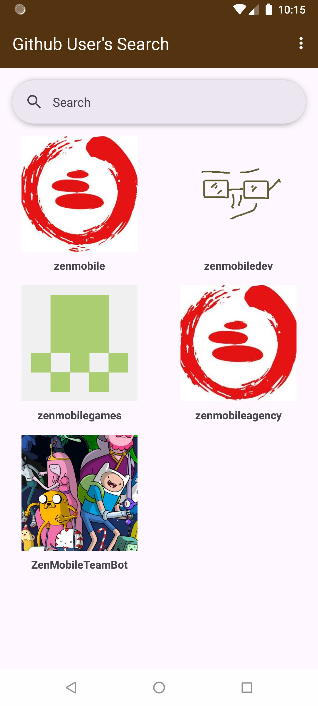
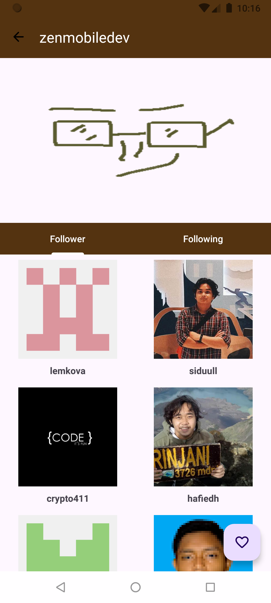
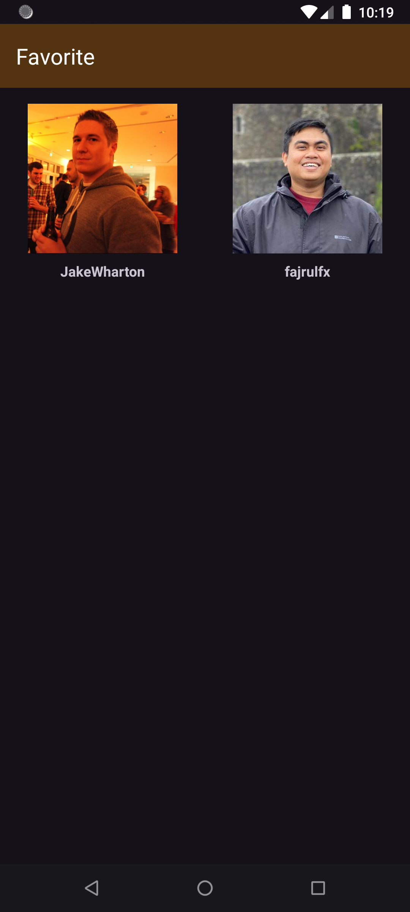
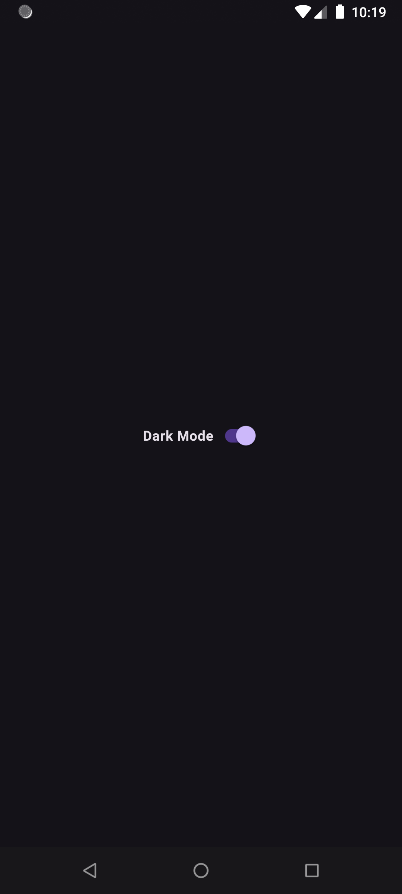
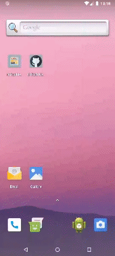

# Github User

  

:exclamation: **WARNING**

> Sesuai dengan [terms of use](https://www.dicoding.com/termsofuse) di Dicoding, submission kelas Dicoding Academy haruslah hasil karya Anda sendiri.

>Kode yang didapatkan dari sumber lain (website, buku, forum, GitHub, dan lain-lain) hanya digunakan sebagai referensi. **Tingkat kesamaannya tidak boleh lebih dari 70%.**

> Kami memiliki hak mutlak untuk mengenakan sanksi kepada peserta plagiat yang melanggar ketentuan di atas. Sanksi tersebut berupa penangguhan akun Dicoding. Artinya Anda tidak dapat melakukan submission apapun di kelas Dicoding Academy selama masa penangguhan. Progress belajar peserta kelas Dicoding Academy pun, otomatis kami reset ke 0 (nol), tanpa terkecuali.

# Table Of Contents
- [Introduction](#introduction)
- [Demo](#demo)
- [Tech Stack](#tech-stack)

## Introduction
For more details.
* English 
> GitHub User is a mobile application focused on GitHub user profiles. Key features include:
> * User Search: Discover and explore GitHub user profiles.
> * Favorites: Bookmark users for quick access.
> * User Details: View detailed information about GitHub users.
> * Dark Mode: Toggle to a dark theme for enhanced usability in low-light environments.

* Bahasa
> _GitHub User_ adalah aplikasi seluler yang berfokus pada profil pengguna GitHub. Fitur utama:
> * Pencarian Pengguna: Temukan dan jelajahi profil pengguna GitHub.
> * Favorit: Tandai pengguna untuk akses cepat.
> * Detail Pengguna: Lihat informasi detail tentang pengguna GitHub.
> * Mode Gelap: Beralih ke tema gelap untuk meningkatkan kegunaan di lingkungan dengan cahaya redup.

## Demo

| Home Page                              | Detail Page                              | Favorite Page                              | Dark Mode                              |
|----------------------------------------|------------------------------------------|--------------------------------------------|----------------------------------------|
|  |  |  |  |

| Preview                                 |
|-----------------------------------------|
|  |

## Tech Stack

- [Kotlin](https://kotlinlang.org/): First class and official programming language for Android development.
- [Glide](https://github.com/bumptech/glide): An image loading and caching library for Android focused on smooth scrolling
- [Material Design](https://material.io/develop/android/docs/getting-started): Material is a design system created by Google to help teams build high-quality digital experiences for Android, iOS, Flutter, and the web.
- [ROOM](https://developer.android.com/jetpack/androidx/releases/room?hl=en): A persistence library that provides an abstraction layer over SQLite to allow for more robust database access while harnessing the full power of SQLite.
- [Data Store](https://developer.android.com/topic/libraries/architecture/datastore?hl=en): A data storage solution that provides a way to store key-value pairs or typed objects with protocol buffers, offering a modern alternative to SharedPreferences.
- [ViewModel](https://developer.android.com/topic/libraries/architecture/viewmodel?hl=en): A class designed to store and manage UI-related data in a lifecycle-conscious way, allowing data to survive configuration changes such as screen rotations.
- [Retrofit](https://github.com/square/retrofit): A type-safe HTTP client for Android and Java used to handle REST API calls and network requests in a concise and efficient manner.